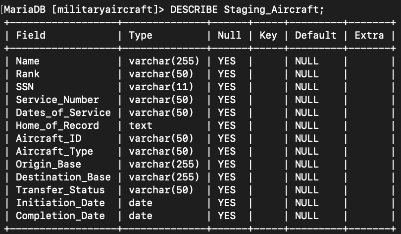
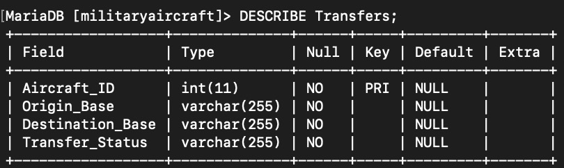
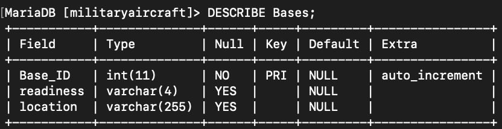

# Aircraft-Data-CSV-Generator

# Operation LUSTY 2.0 Aircraft Data Generator

This Python script simulates the movement of military aircraft and service members between bases during the Vietnam War, as part of a fictional operation named **Operation LUSTY 2.0**, inspired by historical events following World War II.

The data generated includes details like service members' names, ranks, SSNs, service numbers, and aircraft types. The data can be exported into a CSV file, which can be used for various purposes such as manual backups or for inserting into databases like **MariaDB**, **Redis**, **MongoDB**, or **DynamoDB**.

## Features

- Generates detailed information for **fictional service members** and **aircraft transfers** between military bases.
- Output includes fields such as **rank**, **service number**, **aircraft type**, **origin and destination bases**, and **transfer status**.
- Data generated is entirely fictional but based on historical wartime operations, making it ideal for simulating wartime scenarios.
- The script outputs data as a CSV file, ready for use in **Excel** or other data manipulation tools.
- Data can be piped into **cloud databases** such as **MariaDB**, **Redis**, **MongoDB**, or **DynamoDB**.

## Key Visuals

---

**Entity-Relationship Diagram of the Database**

Below are key screenshots representing the generated data and processes:

---

### Staging Table Setup


### Aircraft Transfer Process 



### Bases Table




## Historical Reference

**Operation LUSTY** was a real post-World War II mission aimed at recovering German aircraft technology. This script, however, fictionalizes a Vietnam War-era operation under a similar codename. The data generated mimics the movement of aircraft and personnel between bases during wartime scenarios, with a specific focus on the Vietnam War.

## Requirements

This script requires Python 3.12 and the following Python libraries:

- `Faker` for generating realistic names, ranks, addresses, and other personal data.
- If extending the functionality to connect to cloud databases, install:
  - `redis` for Redis database
  - `pymongo` for MongoDB
  - `boto3` for DynamoDB

# MariaDB Connection Example

This script demonstrates how to connect to a MariaDB database using Python.

Requirements

To use this feature, you need the following dependencies:

	•	mysql-connector-python or PyMySQL for connecting to MariaDB

You can install these dependencies using the following command:

pip install mysql-connector-python

Basic Usage

	1.	Update your connection parameters (e.g., host, user, password, database) in the script to match your MariaDB setup.
	2.	Run the script to connect and execute queries:

import mysql.connector

connection = mysql.connector.connect(
    host="localhost",
    user="your_username",
    password="your_password",
    database="your_database_name"
)

cursor = connection.cursor()
cursor.execute("SELECT * FROM your_table_name")
results = cursor.fetchall()

for row in results:
    print(row)


You can install all dependencies by running:

```bash
pip install -r requirements.txt
